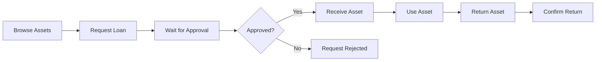
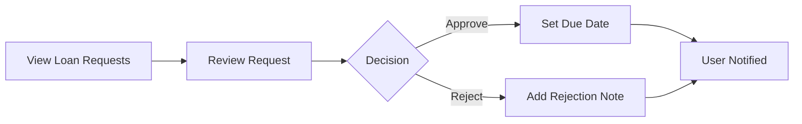

# Design: Refine Inventory UI

## Layout Decisions

### Asset Management Page Header
```
┌─────────────────────────────────────────────────────────────────┐
│  Manajemen Aset                      [Scan QR] [+ Tambah Aset]  │
├─────────────────────────────────────────────────────────────────┤
│  [Status ▼] [Kategori ▼]                                        │
├─────────────────────────────────────────────────────────────────┤
│  ┌─────────────────────────────────────────────────────────────┐│
│  │ Manajemen Aset                            [🔍 Search...]   ││
│  │─────────────────────────────────────────────────────────────││
│  │ Kode Aset │ Nama │ Kategori │ Status │ Lokasi │ Aksi       ││
│  │ ...                                                        ││
│  └─────────────────────────────────────────────────────────────┘│
└─────────────────────────────────────────────────────────────────┘
```

**Rationale**: 
- Title and primary actions in same row (visual hierarchy)
- Filters as compact chips below header
- Single search inside DataTable (no duplication)
- DataTable handles its own search filtering

---

### Loan Table Columns

| Column | Type | Visibility | Notes |
|--------|------|------------|-------|
| Asset | Text + Code | All | Asset name with code in parentheses |
| Borrower | Text | Admin only | Who requested the loan |
| Status | Badge | All | Colored badge (pending=yellow, approved=green, etc.) |
| Request Date | Date | All | When the request was made |
| **Borrow Date** | Date | All | When asset was given to borrower |
| **Due Date** | Date | All | Expected return date |
| Actions | Buttons | All | View details |

**Analysis Result**: Yes, showing dates is important for:
1. **Tracking**: Admins need to know when items are due
2. **Reminders**: Highlight overdue items
3. **History**: Users can see their loan timeline

---

## Status Color Mapping

| Status | Color | Badge Variant |
|--------|-------|---------------|
| PENDING | Orange | warning |
| APPROVED | Blue | info |
| BORROWED | Green | success |
| OVERDUE | Red | error |
| RETURNED | Gray | default |
| REJECTED | Red | error |

---

## User Flow Diagrams

### User Borrowing Flow


### Admin Approval Flow


---

## i18n Keys to Add

```json
{
  "inventory": {
    "scan_qr": "Scan QR",
    "add_asset": "Add Asset",
    "borrow_date": "Borrow Date",
    "due_date": "Due Date",
    "overdue": "Overdue",
    "days_remaining": "{{days}} days remaining",
    "my_loans": "My Loans",
    "no_loans": "No loan requests yet",
    "print_label": "Print Label",
    "print_selected": "Print Selected"
  }
}
```

---

## Barcode Label Design

### Label Dimensions
- **Width**: 3.5 cm
- **Height**: 7 cm
- **Format**: Code128 (compact, widely compatible)

### Label Layout
```
┌─────────────────────┐
│    [SatuData Logo]  │  ← 0.5cm from top
│                     │
│  |||||||||||||||    │  ← Barcode (Code128)
│  |||||||||||||||    │
│                     │
│    AST-2026-0042    │  ← Serial/Asset Code
│    Laptop Asus      │  ← Asset Name (truncated)
└─────────────────────┘
```

### A4 Print Layout
```
┌──────┬──────┬──────┬──────┐
│Label │Label │Label │Label │  Row 1
├──────┼──────┼──────┼──────┤
│Label │Label │Label │Label │  Row 2
├──────┼──────┼──────┼──────┤
│ ...  │ ...  │ ...  │ ...  │  Rows 3-8
└──────┴──────┴──────┴──────┘

4 columns × 8 rows = 32 labels per A4
Page margins: 1cm all sides
```
