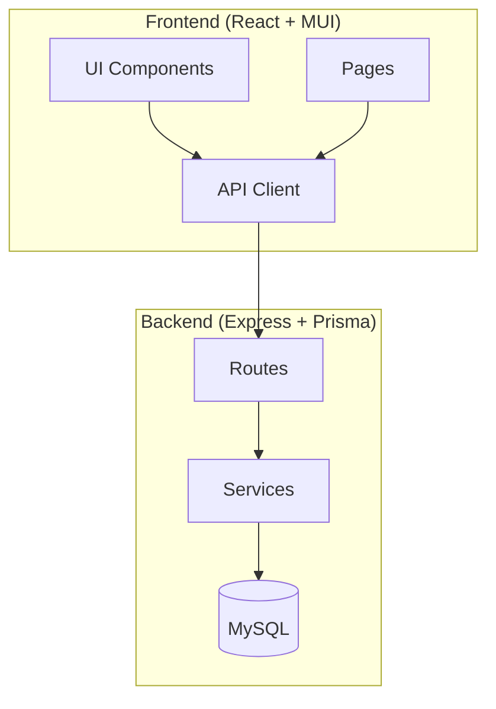

# Inventory Asset Management - Implementation Plan

## Overview
This document outlines the comprehensive plan for building a full-featured Asset Management system with CRUD operations, clean design, and i18n support.

## Architecture Overview



## Data Models (Prisma Schema)

### Asset
| Field | Type | Description |
|-------|------|-------------|
| id | Int | Primary Key |
| name | String | Asset name |
| assetCode | String | Unique asset code |
| barcode | String | Unique barcode |
| qrCode | String? | QR Code data |
| categoryId | Int | Foreign Key |
| status | String | AVAILABLE, BORROWED, MAINTENANCE, LOST |
| brand | String? | Brand |
| model | String? | Model |
| serialNumber | String | Unique serial number |
| purchaseDate | DateTime? | Purchase date |
| purchasePrice | Float? | Price |
| location | String? | Storage location |
| description | String? | Description |
| imageUrl | String? | Image URL |
| createdById | Int | Foreign Key (User) |

### AssetCategory
| Field | Type | Description |
|-------|------|-------------|
| id | Int | Primary Key |
| name | String | Category name |
| code | String | Unique code |

## Backend API Endpoints

### Assets CRUD
```
GET    /api/inventory/assets           - List all assets (with filters, pagination, search)
GET    /api/inventory/assets/:id      - Get single asset
POST   /api/inventory/assets           - Create new asset
PUT    /api/inventory/assets/:id      - Update asset
DELETE /api/inventory/assets/:id      - Delete asset
POST   /api/inventory/assets/:id/generate-barcode - Generate barcode
POST   /api/inventory/assets/:id/regenerate-qr     - Regenerate QR code
```

### Categories CRUD (Existing - enhance)
```
GET    /api/inventory/categories      - List categories
POST   /api/inventory/categories      - Create category
PUT    /api/inventory/categories/:id  - Update category
DELETE /api/inventory/categories/:id  - Delete category
```

## Frontend Pages & Components

### Pages
1. `/inventory/assets` - Asset List with CRUD
2. `/inventory/assets/[id]` - Asset Detail View
3. `/inventory/categories` - Category Management

### Components
1. **AssetList** - Table view with filters, search, pagination
2. **AssetForm** - Dialog form for create/edit
3. **AssetCard** - Card view for grid display
4. **AssetDetail** - Full detail view with history
5. **CategoryList** - Category management table
6. **CategoryForm** - Category create/edit dialog

## Design System

### Color Palette
- Primary: `#1976d2` (Blue)
- Secondary: `#7b1fa2` (Purple)
- Success: `#2e7d32` (Green)
- Warning: `#ed6c02` (Orange)
- Error: `#d32f2f` (Red)
- Background: `#f5f5f5` (Light gray)
- Paper: `#ffffff` (White)

### Status Colors
- AVAILABLE: `#2e7d32` (Green)
- BORROWED: `#ed6c02` (Orange)
- MAINTENANCE: `#d32f2f` (Red)
- LOST: `#9e9e9e` (Gray)

### Layout
- Sidebar: 240px width
- Content: Fluid with max-width 1400px
- Cards: 8px border-radius, elevation 2
- Spacing: 8px base unit (multiples: 1, 2, 3)

## i18n Keys (id.json / en.json)

New keys to add:
```json
{
  "inventory": {
    "assets": "Assets",
    "add_asset": "Add Asset",
    "edit_asset": "Edit Asset",
    "delete_asset": "Delete Asset",
    "asset_name": "Asset Name",
    "asset_code": "Asset Code",
    "barcode": "Barcode",
    "serial_number": "Serial Number",
    "brand": "Brand",
    "model": "Model",
    "category": "Category",
    "status": "Status",
    "location": "Location",
    "purchase_date": "Purchase Date",
    "purchase_price": "Purchase Price",
    "description": "Description",
    "image": "Image",
    "image_url": "Image URL",
    "created_by": "Created By",
    "created_at": "Created At",
    "updated_at": "Updated At",
    "actions": "Actions",
    "search_assets": "Search assets...",
    "filter_by_status": "Filter by status",
    "filter_by_category": "Filter by category",
    "no_assets_found": "No assets found",
    "confirm_delete_asset": "Are you sure you want to delete this asset?",
    "asset_deleted": "Asset deleted successfully",
    "asset_created": "Asset created successfully",
    "asset_updated": "Asset updated successfully",
    "error_creating_asset": "Failed to create asset",
    "error_updating_asset": "Failed to update asset",
    "error_deleting_asset": "Failed to delete asset",
    "view_details": "View Details",
    "all_statuses": "All Statuses",
    "all_categories": "All Categories",
    "qr_code": "QR Code",
    "download_barcode": "Download Barcode",
    "download_qr": "Download QR Code",
    "asset_info": "Asset Information",
    "loan_history": "Loan History",
    "activity_log": "Activity Log"
  }
}
```

## Implementation Order

1. **Backend API (Step 1-2)**
   - Create asset routes folder structure
   - Implement GET all assets (with filters)
   - Implement GET single asset
   - Implement POST create asset
   - Implement PUT update asset
   - Implement DELETE asset
   - Add barcode/QR generation

2. **Frontend - Asset Management (Step 3-6)**
   - Create API constants
   - Create AssetList page
   - Create AssetForm dialog
   - Create AssetDetail page

3. **Frontend - Category Management (Step 7)**
   - Enhance existing category page

4. **Design & i18n (Step 8-9)**
   - Apply consistent design
   - Add missing translations
