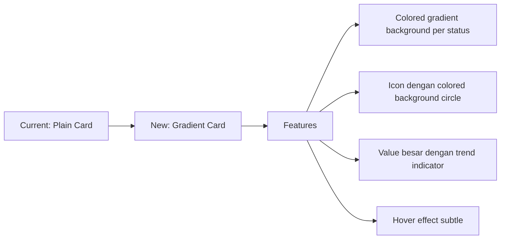
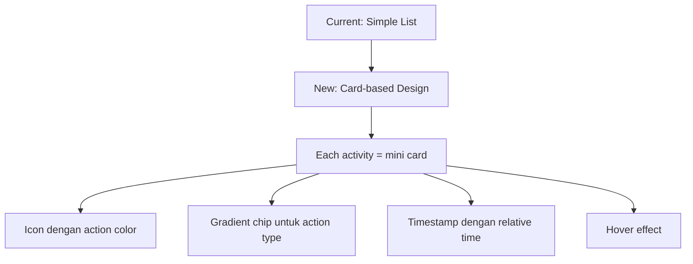

# Inventory Dashboard Redesign Plan

## Objective
Redesain dashboard inventory agar lebih menarik, modern, dan user-friendly dengan mengadaptasi desain dari finance dashboard yang sudah ada.

## Current State Analysis

### Komponen yang Perlu Diperbaiki:
1. **Stat Cards** - Menggunakan MUI Card polos dengan warna solid
2. **Pie Chart** - Custom SVG pie chart yang perlu digantikan dengan chart library
3. **Category Bars** - Progress bar sederhana tanpa visual menarik
4. **Recent Activity** - List sederhana tanpa variasi visual
5. **Borrowing Workflow** - Step indicator standar

### Target Desain:
- Adaptasi dari finance dashboard: `rounded-2xl`, `shadow-sm`, `border`,gradien
- Tailwind CSS styling untuk consistency
- Chart components dari `~/components/charts`
- Dark/light mode support

---

## Redesign Plan

### 1. Header Section Enhancement
- Tambahkan welcome message dengan current date
- Tambahkan quick action buttons (Add Asset, View Loans)
- Background gradient subtle

### 2. Statistics Cards Redesign


**New Stat Card Design:**
- Background: Gradient colors (blue-600, green-500, orange-500, red-500, purple-500)
- Icon: White icon di colored circle
- Value: Large bold number
- Label: Smaller text dengan uppercase
- Hover: translateY(-2px) dengan enhanced shadow

**Card Mapping:**
| Card | Current Color | New Gradient |
|------|---------------|---------------|
| Total Assets | primary | `bg-gradient-to-br from-blue-500 to-blue-600` |
| Available | success | `bg-gradient-to-br from-green-500 to-green-600` |
| Borrowed | warning | `bg-gradient-to-br from-orange-500 to-orange-600` |
| Maintenance | error | `bg-gradient-to-br from-red-500 to-red-600` |
| Pending Requests | info | `bg-gradient-to-br from-purple-500 to-purple-600` |
| Overdue | error | `bg-gradient-to-br from-red-600 to-red-700` |

### 3. Charts Redesign

#### 3.1 Status Distribution Pie Chart
- **Replace:** Custom SVG PieChart → ApexCharts PieChart
- Add: Legend di bottom dengan colors
- Add: Tooltip on hover
- Add: Center label dengan total

#### 3.2 Category Distribution
- **Replace:** Simple progress bars → Horizontal Bar Chart
- Add: Grid lines
- Add: Animated bars
- Add: Value labels

### 4. Recent Activity Redesign


- Convert list items ke card-based design
- Tambah action-specific icons dengan colors
- Gunakan gradient chips untuk action labels
- Relative time display (2 jam yang lalu, dll)

### 5. Borrowing Workflow Redesign
- Style yang lebih modern dengan gradient header
- Step indicators dengan better visual hierarchy
- Active step highlighting dengan animation

### 6. Layout Improvements
- Grid: 4 columns untuk stats (2 di mobile)
- Gap: Consistent spacing (gap-4 md:gap-6)
- Cards: Consistent padding (p-4 atau p-6)
- Border radius: rounded-2xl untuk semua cards

---

## Implementation Steps

### Step 1: Setup & Imports
- Import chart components dari `~/components/charts`
- Import Tailwind CSS utilities
- Keep MUI components untuk core functionality

### Step 2: Create New StatCard Component
```jsx
// New StatCard design pattern dari BalanceCard
<div className="bg-gradient-to-br from-blue-500 to-blue-600 p-6 rounded-2xl shadow-lg text-white">
  {/* Icon circle */}
  {/* Value dan label */}
  {/* Decorative circles */}
</div>
```

### Step 3: Replace Charts
- Replace custom PieChart dengan ApexCharts version
- Create BarChart untuk categories

### Step 4: Style Recent Activity
- Convert ke card-based design
- Add gradients dan effects

### Step 5: Polish & Animations
- Add transition effects
- Ensure dark/light mode compatibility
- Add hover states

---

## Files to Modify
1. `frontend/src/pages/inventory/index.jsx` - Main dashboard
2. `frontend/src/features/inventory/components/BorrowingWorkflow.jsx` - Workflow styling (optional)

---

## Success Criteria
- [ ] Stat cards menggunakan gradient backgrounds
- [ ] Charts menggunakan ApexCharts components
- [ ] Recent activity lebih visual dengan cards
- [ ] Consistent rounded-2xl styling
- [ ] Dark/light mode works properly
- [ ] Hover effects pada interactive elements
