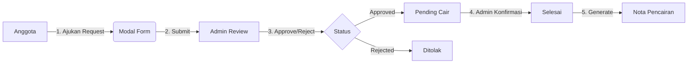

# Rencana Pengembangan Sistem Reimbursement & Restrukturasi Menu

## Ringkasan Tugas

Tugas ini mencakup 3 bagian utama:
1. Restrukturasi menu Inventory (pindahkan dari admin ke menu umum)
2. Hapus route yang tidak terpakai (Report WA, Report PDF, Sign System)
3. Buat sistem Reimbursement Keuangan baru (Full CRUD + Database)

---

## BAGIAN 1: Restrukturasi Menu Inventory

### Current State
Menu Inventory saat ini ada di section `admin` dengan permission `canManageUsers`.

### Masalah
- Inventory seharusnya accessible oleh semua user (bukan hanya admin)
- Beberapa fitur di-hidden berdasarkan role, tapi menu masih di admin section

### Solusi
Pindahkan Inventory dari `admin` section ke `main` section (menu umum), dengan visibility berdasarkan role:

| Menu Item | Visibility |
|-----------|------------|
| Inventory Dashboard | Semua user (canViewDashboard) |
| Asset Management | canManageInventory (ADMIN, KOORDINATOR_INVENTARIS, SUPER_ADMIN) |
| Category Management | isSuperAdmin |
| Loan Management | canManageInventory |
| Shop | Semua user |

### File yang Diubah
- `frontend/src/config/navigation.js` - Pindahkan dari `admin` ke `main` section

---

## BAGIAN 2: Hapus Route Tidak Terpakai

### Routes yang akan dihapus
1. **Report to WA** - `/report/wa`
2. **Report to PDF** - `/report/pdf`
3. **Sign System** - `/sign-system`

### File yang Diubah
- `frontend/src/config/navigation.js` - Hapus items:
  - `report-wa`
  - `report-pdf`
  - `sign-system`

### Translation keys yang perlu dihapus
- `sidebar.report_wa`
- `sidebar.report_pdf`
- `sidebar.sign_system`

---

## BAGIAN 3: Sistem Reimbursement Keuangan

### Alur Sistem



### Fitur

#### A. Anggota - Ajukan Reimbursement
- **Modal Form** (pakai ModalWrapper global)
- **Form Fields:**
  - Jumlah uang (amount) - required, numeric
  - Bukti/nota (evidence image) - required, upload image
  - Metode pencairan - required, select:
    - Cash
    - Bank Transfer
    - Cashless (e-money)
  - Nomor rekening/HP - required (untuk Bank/Cashless)

#### B. Admin - Review & Approval
- List semua request reimbursement
- Filter by status: PENDING, APPROVED, REJECTED, COMPLETED
- Approve/Reject dengan catatan
- Ubah status ke COMPLETED (dengan ModalWrapper confirm)

#### C. Nota Pencairan
- Generate nota setelah status COMPLETED
- Menggunakan logo: `frontend/src/assets/logo-omk-bnw.png`
- Format seperti nota resmi

### Database Schema

```prisma
model Reimbursement {
  id              Int       @id @default(autoincrement())
  userId          Int
  amount          Float
  evidenceImage   String?   @db.Text
  disbursementMethod String  // CASH, BANK, CASHLESS
  accountNumber   String?   // untuk BANK/CASHLESS
  status          String    @default("PENDING")  // PENDING, APPROVED, REJECTED, COMPLETED
  notes           String?   @db.Text
  approvedById    Int?
  approvedAt      DateTime?
  completedAt     DateTime?
  createdAt       DateTime  @default(now())
  updatedAt       DateTime  @updatedAt
  
  user            User      @relation("ReimbursementUser", fields: [userId], references: [id])
  approvedBy      User?     @relation("ReimbursementApprover", fields: [approvedById], references: [id])

  @@index([userId])
  @@index([status])
  @@index([approvedById])
}
```

### User Relation Tambahan di Schema
```prisma
// Di model User tambahkan:
reimbursementRequests Reimbursement[] @relation("ReimbursementUser")
approvedReimbursements Reimbursement[] @relation("ReimbursementApprover")
```

### API Endpoints (Backend)

| Method | Endpoint | Description |
|--------|----------|-------------|
| GET | `/api/reimbursements` | List semua reimbursement (admin) |
| GET | `/api/reimbursements/my` | List request sendiri (user) |
| POST | `/api/reimbursements` | Ajukan reimbursement baru |
| PUT | `/api/reimbursements/[id]/approve` | Approve/Reject (admin) |
| PUT | `/api/reimbursements/[id]/complete` | Tandai selesai (admin) |
| GET | `/api/reimbursements/[id]/receipt` | Generate nota (PDF) |

### Frontend Pages & Components

| Path | Description |
|------|-------------|
| `/reimbursement` | Dashboard reimbursement (semua user) |
| `/reimbursement/request` | Form ajukan (ModalWrapper) |
| `/reimbursement/admin` | Admin panel (manage semua request) |

### Translation Keys Baru
```json
{
  "sidebar": {
    "reimbursement": "Reimbursement",
    "my_requests": "Permintaan Saya",
    "admin_panel": "Panel Admin"
  },
  "reimbursement": {
    "title": "Reimbursement Keuangan",
    "request_reimbursement": "Ajukan Reimbursement",
    "amount": "Jumlah",
    "evidence": "Bukti/Nota",
    "disbursement_method": "Metode Pencairan",
    "cash": "Tunai",
    "bank": "Transfer Bank",
    "cashless": "Cashless/e-Money",
    "account_number": "Nomor Rekening/HP",
    "status": "Status",
    "pending": "Menunggu",
    "approved": "Disetujui",
    "rejected": "Ditolak",
    "completed": "Selesai",
    "approve": "Setuju",
    "reject": "Tolak",
    "complete": "Tandai Selesai",
    "notes": "Catatan",
    "receipt": "Nota Pencairan"
  }
}
```

---

## Implementation Order

### Phase 1: Setup (Database)
1. Tambah migration untuk tabel Reimbursement
2. Update User model dengan relations
3. Generate Prisma client

### Phase 2: Backend API
1. Create API endpoints untuk CRUD
2. Implement upload image untuk bukti
3. Generate nota PDF (dengan logo)

### Phase 3: Frontend Navigation
1. Hapus route tidak terpakai
2. Pindahkan Inventory menu
3. Tambah menu Reimbursement

### Phase 4: Frontend Features
1. Halaman dashboard reimbursement
2. Modal form ajukan request
3. Admin panel untuk approve/complete
4. Nota pencairan

---

## File yang Akan Dibuat/Diubah

### Backend
- `backend/prisma/schema.prisma` - Tambah model Reimbursement
- `backend/routers/api/reimbursements/GET__index/index.js` - List all
- `backend/routers/api/reimbursements/GET__my/index.js` - My requests
- `backend/routers/api/reimbursements/POST__index/index.js` - Create
- `backend/routers/api/reimbursements/[id]/PUT__approve/index.js` - Approve/Reject
- `backend/routers/api/reimbursements/[id]/PUT__complete/index.js` - Complete
- `backend/routers/api/reimbursements/[id]/GET__receipt/index.js` - Generate nota

### Frontend
- `frontend/src/config/navigation.js` - Restructure menu
- `frontend/src/pages/reimbursement/index.jsx` - Main page
- `frontend/src/pages/reimbursement/admin/index.jsx` - Admin panel
- `frontend/src/features/reimbursement/components/RequestForm.jsx` - Modal form
- `frontend/src/features/reimbursement/components/Receipt.jsx` - Nota component

---

## Catatan Penting

1. **ModalWrapper** sudah ada di `frontend/src/components/ModalWrapper.jsx` - gunakan untuk form request
2. **Logo** untuk nota ada di `frontend/src/assets/logo-omk-bnw.png`
3. **Permission system** sudah ada - use `canManageFinance` untuk admin features
4. **i18n** default adalah Bahasa Indonesia (`id`)
